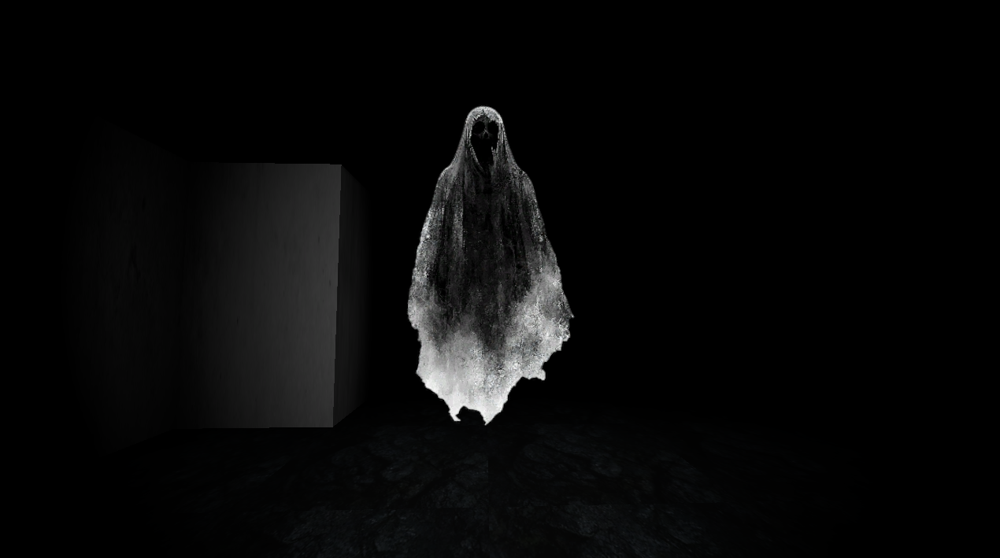

# You Are Not Alone

look for the exit!

## Description

You Are Not Alone is a first-person horror game where the player finds themselves trapped inside a mysterious maze with no clear way out. The maze is confusing, unfamiliar, and designed to make the player question whether they are moving toward freedom or simply becoming more lost.

But getting lost is not the only problem.

Something else is inside the maze.

A ghost roams the corridors, turning the maze from a simple navigation challenge into a fight for survival. The player must explore the maze, find their way through its confusing paths, and avoid the ghost long enough to discover a way out.

The Premise

You wake up inside a maze with no explanation of how you got there.

There are corridors in every direction, but no obvious exit. Every turn can lead somewhere new, yet the maze begins to feel strangely repetitive. The deeper you go, the harder it becomes to remember where you came from.

Then you realize something:

You are not alone.

A ghost is somewhere inside the maze.

You don't always know where it is. You may hear it before you see it, notice it at the end of a corridor, or suddenly realize that the path behind you is no longer safe.

Your goal is simple:

Find the way out before the ghost finds you.

### Screenshots

### Controls

- Move: `W` `A` `S` `D` or Arrow Keys

## Getting Started

1. Install [Godot 4.7](https://godotengine.org/download/)
2. Clone the repo and open it in Godot
3. Hit Play (F5)

Or play it [in your browser](https://khushnaseiba.github.io/You_are_not_alone)
